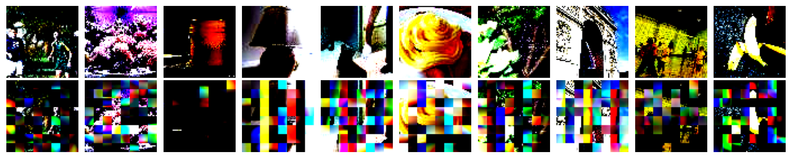

inception-resnet-v2를 이용하여 이미지 분류 모델을 학습하고 평가
inception-resnet-v2는 labeled 데이터셋만 사용하므로 unlabeled 데이터셋은 사용하지 않음 -> data를 전부 활용학기 위해 구조 변경
Masked Autoencoder를 이용하여 unlabeled 데이터셋을 활용 시도 그러나 성능이 좋지 않음

# Masked Autoencoder results
(epoch 50)

CNN기반 Autoencoder를 이용하여 unlabeled 데이터셋을 활용 시도 이때 encoder는 inception-resnet-v2의 구조를 차용